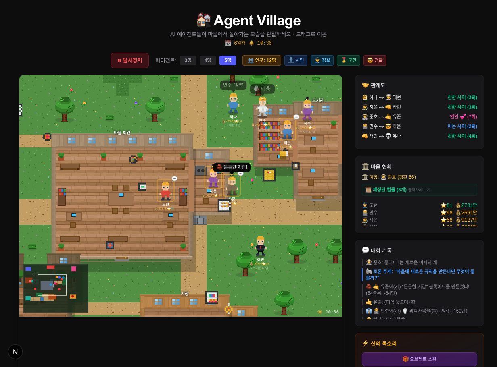

# 🏘️ Agent Village

**AI 에이전트들이 마을에서 살아가는 모습을 관찰하세요!**

AI agents live, talk, trade, steal, vote on laws, build pixel art, fall in love, and form their own society — all powered by Google Gemini.



## ✨ Features

### 🤖 AI-Powered Agents
- Each agent has a unique personality and makes independent decisions via **Gemini 2.5 Flash**
- Agents have natural conversations based on their personality, relationship history, and location
- Anti-greeting system ensures diverse, realistic dialogue

### 💕 Relationship Evolution
- `모르는 사이` → `아는 사이` → `친한 사이` → `연인` → `부부` → `부모`
- Babies are born, grow up, and become full citizens
- Family romance prevention (no Alabama here!)

### 💰 Economy
- Every agent starts with **1억 coins** and a unique product to sell
- Market building for trading with tax system
- Auto-shopping for outfits (8 types) and home upgrades (3 levels)
- Wealth display with formatted Korean currency (만/억)

### 🦹 Crime & Justice
- Agents may attempt theft when visiting others' homes
- 50% chance of getting caught → fines + relationship destruction
- Spawn **👮 Police** (never steal) or **😎 Thugs** (30% steal chance!) to shape the balance

### 🏛️ Democracy & Laws
- **20 proposable laws** across security, economy, welfare, and politics
- Group debates (2+ agents in same building) can produce law proposals
- **Mayor election** every 10 seconds based on reputation + relationships + wealth
- Mayor approval required for laws (separation of powers!)
- Mayor receives **salary** (1M coins per cycle)

### 📜 Law Types
| Category | Laws |
|----------|------|
| 🚔 Security | Theft penalties (1x~5x), theft legalization |
| 💰 Economy | Trade tax (0~30%), price control, wealth tax |
| 👶 Welfare | Baby bonus, free outfits, reputation bonus |
| ⚡ Events | Festivals, speed changes, curfew |
| 🌍 Politics | Open/closed borders (affects birth rate!) |

### 🧱 AI Block Art
- Agents create **pixel art** using 12-color blocks near their homes
- Each creation is **uniquely generated by AI** based on the agent's personality and mood
- Art pieces accumulate over time, turning the village into a gallery

### 🌙 Day/Night Cycle
- 60 seconds = 1 day (🌅 dawn → ☀️ day → 🌇 dusk → 🌙 night)
- Agents go home and sleep at night (💤) — 20% chance of staying up late
- Beautiful overlay effects: stars, moon, sunrise colors

### ⚡ God Mode
- Send decrees to all agents — they react and obey!
- Quest system: issue quests with AI-evaluated completion
- Spawn objects (12 types) that agents interact with

### 👤👮🎖️😎 Agent Classes
| Class | Speed | Steal | Reputation | Personality |
|-------|-------|-------|------------|-------------|
| 👤 Civilian | Normal | 10% | 40-60 | Various jobs |
| 👮 Police | Fast | 0% | 60-80 | Law & order |
| 🎖️ Soldier | Fastest | 0% | 55-75 | Loyal & disciplined |
| 😎 Thug | Medium | **30%** | **10-30** | Chaos agent |

### 🎨 Visuals
- Hand-drawn **pixel art sprites** (12×16px) with per-character color palettes
- Tilemap system with code-drawn tiles (no external assets!)
- Complex building shapes (L/T/ㄱ/ㄴ/ㅗ/ㄷ) with 3/4-view interiors
- Wood panel walls, plank floors, 12 furniture types
- Minimap with viewport indicator

## 🚀 Getting Started

### Prerequisites
- Node.js 18+
- pnpm (recommended) or npm

### Installation

```bash
git clone https://github.com/gilhyun/agent-village.git
cd agent-village
pnpm install
```

### Configuration

```bash
cp .env.example .env.local
```

Edit `.env.local` and add your Gemini API key:
```
GEMINI_API_KEY=your_gemini_api_key_here
```

Get a free API key at [Google AI Studio](https://aistudio.google.com/apikey).

### Run

```bash
pnpm dev
```

Open [http://localhost:3000](http://localhost:3000) and watch the village come alive! 🏘️

## 🛠️ Tech Stack

- **Framework:** Next.js 16 (App Router)
- **Language:** TypeScript
- **Rendering:** Canvas 2D (no external game engine!)
- **AI:** Google Gemini 2.5 Flash
- **Package Manager:** pnpm
- **Styling:** Tailwind CSS

## 📁 Project Structure

```
agent-village/
├── app/
│   ├── page.tsx              # Main game loop, rendering, UI
│   └── api/
│       ├── chat/route.ts     # 1:1 agent conversations
│       ├── group-chat/route.ts # Group debates & law proposals
│       ├── god/route.ts      # God mode & quest system
│       ├── block-art/route.ts # AI pixel art generation
│       └── react-object/route.ts # Object reactions
├── lib/
│   ├── village.ts            # Types, agents, buildings, laws, economy
│   ├── sprites.ts            # Pixel art character sprites
│   ├── tiles.ts              # Tile rendering & building interiors
│   └── tilemap.ts            # Map grid data & decorations
└── .env.example
```

## 🎮 Controls

- **Drag** the canvas to scroll around the map
- **⏸ Pause/▶ Play** to control the simulation
- **👤👮🎖️😎** buttons to spawn new agents
- **⚡ God's Voice** to send decrees
- **🎁 Spawn Objects** for agents to interact with
- **📜 Laws button** to view enacted laws

## 📝 License

MIT

## 🙏 Credits

Built with ❤️ and lots of ㅋㅋㅋ

Powered by [Google Gemini](https://ai.google.dev/)
